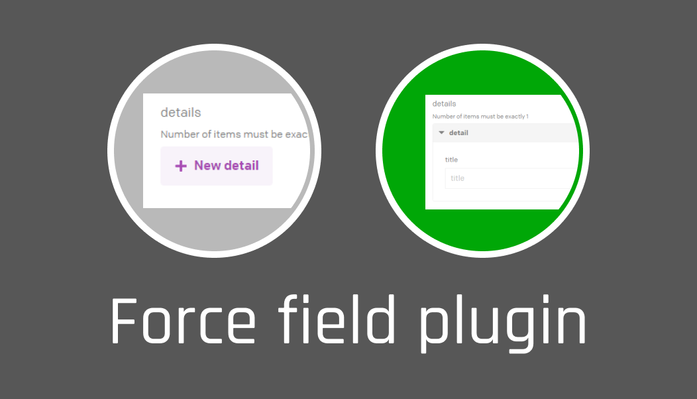
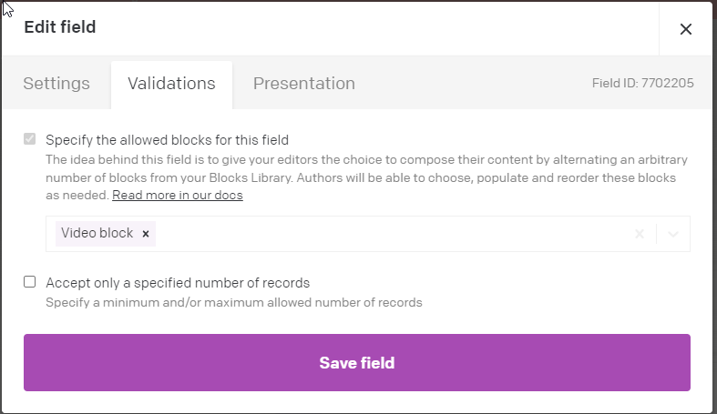
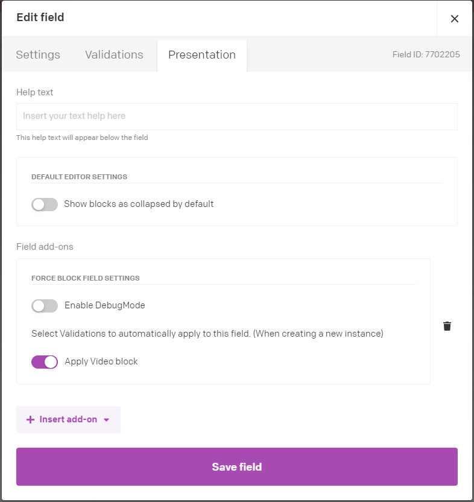
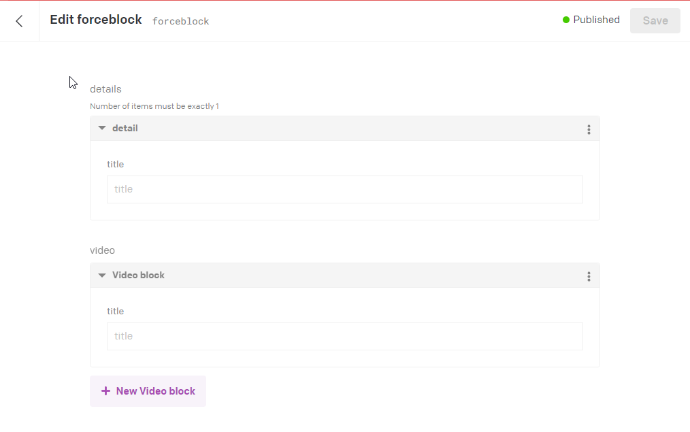

# Force Block Field Plugin

Modula fields let you choose the Blocks you'd like user to be able to apply to you field, by setting blocks in the Validations View. 

However, when a user creates a new instance of the model, it still requires the user to manually add the block, even when it's set to required.

This plugin lets you automatically insert the blocks defined in the validators section of the fields edit properties
dialog. 

Add the Addon and then Select the blocks (matching the ones you've set in the validator) you want to automatically attach
when a new instance of the model is generated.

# DataCMS SDK version

This plugin uses ctx.pendingField which was introduced around this version. 

    "datocms-plugin-sdk": "^0.3.20",
    "datocms-react-ui": "^0.3.21",

#Example
Add the validators you want this field to support

Goto the Presentation Tab and add the Force Blocks plugin. Then select the validators
you want to automatically add to new instances of the model.

When you create a new model or edit an existing one, the plugin will check the field to see if each validation should be applied and apply it, if it isn't already applied.

As you can see, it also works with fields that require 1 or more blocks. 
If you try to remove the block, it will automatically add it back in. All error checking for the block should also continue to work.

##Issues
### lists all blocks used by model in Presentation View.
The introduction of the ctc.pendingField property in SDK v2 meant I could detect the field your were editing, and list only that fields validators, whereas before I had to display all validators for the model.
 

### Localisation
I think there is some jiggery pokery that needs to be done for localisation support, but for lack of documentation, I haven't a clue what that is.
Something to do with field_ids, and fields paths or something.

## Reference

DatoCMS helped fix errors and introduce new features into the SDK which helped make this plugin possible. So big thanks to them for being so on it. 

Links I read to help make this plugin

 * https://www.datocms.com/docs/plugin-sdk/build-your-first-plugin#install-your-plugin-in-the-datocms-web-app
 * https://www.datocms.com/docs/plugin-sdk/publishing-to-marketplace

* https://www.datocms.com/docs/plugin-sdk/manual-field-extensions#enforcing-validations-on-configuration-options
* https://www.datocms.com/docs/plugin-sdk/manual-field-extensions
* https://github.com/datocms/plugins-sdk/tree/a247846e1ee022a2a1e81b7c26b3946b2a7ab8b0
* https://github.com/datocms/plugins/tree/conditional-fields/conditional-fields
* https://www.datocms.com/marketplace/plugins/i/datocms-plugin-conditional-fields
    
## The main reference.
* https://github.com/datocms/plugins/blob/conditional-fields/conditional-fields/src/entrypoints/FieldExtension/index.tsx

### PUblish to market place

* https://www.datocms.com/docs/plugin-sdk/publishing-to-marketplace
* 